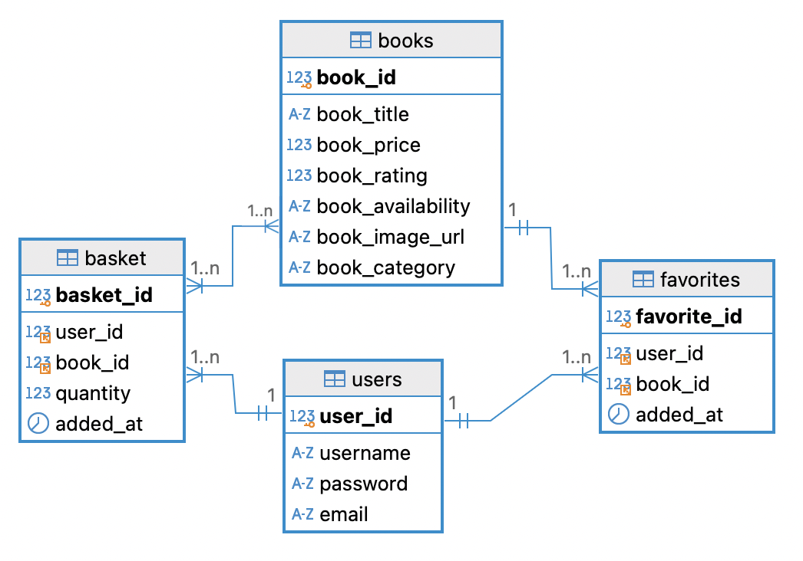

# boksida-fe

Vi har gjort en webbapplikation där man kan sortera och favoritmarkera böcker samt lägga till dem i en varukorg. (Det finns dock ingen funkionalitet för att köpa dem då det inte är en riktig butik.) Applikationen består av en backend i Flask och en frontend i React.

# Installation och start

- Ladda ner projekten med `git clone https://github.com/HenrikBellander/boksida-be` och `https://github.com/HenrikBellander/boksida-fe`
- Installera requirements.txt i backend med `pip install -r requirements.txt`
- Installerea package.json i frontend med `npm install`
- Kör run.py i backend med `python run.py`
- Starta React-projektet med `npm start dev`
- Gå in på http://localhost:5173 för att öppna applikationen

# Grafisk info

Designprincip ”mobile first".
Färgschema, font. (motivering)
 
# Branch-struktur

  - Main/master används för färdig produkt.
  - Dev används som huvudbranch i arbetet.
  - Features branchar ut från dev och mergas in när de är färdiga.

# PR-regler
Vi samarbetar vid pull requests då vi alla är nya på detta.

# Databasstruktur 

Vi har i SQLite-databasen books_data.db fyra tabeller:
- Böcker (books)
- Användare (users)
- Favoritmarkeringar (favorites)
- Varukorg (basket)
  Både basket och favorites är kopplingstabeller mellan books och users.
  

# Kända buggar

När man markerar ✅ nere till höger på en bok adderas boken koppat till user i kopplingstabellen basket i databasen, samtidigt uppdateras varukorgen i realtid i frontend. Man kan växla kategori, lägga till, ta bort på alla sätt - både databasen och frontens varukorg hänger med. Men när man tar bort SISTA boken från varukorgen, så uppdateras och töms databasen korrekt för usern, men på fronten ligger den enda boken kvar. Om man backar tilll kategoritabellen - och sedan går in i samma (eller annan) kategori igen - så är det rätt, varukorgen tom. Om detta fel har det tänkts mycket...
